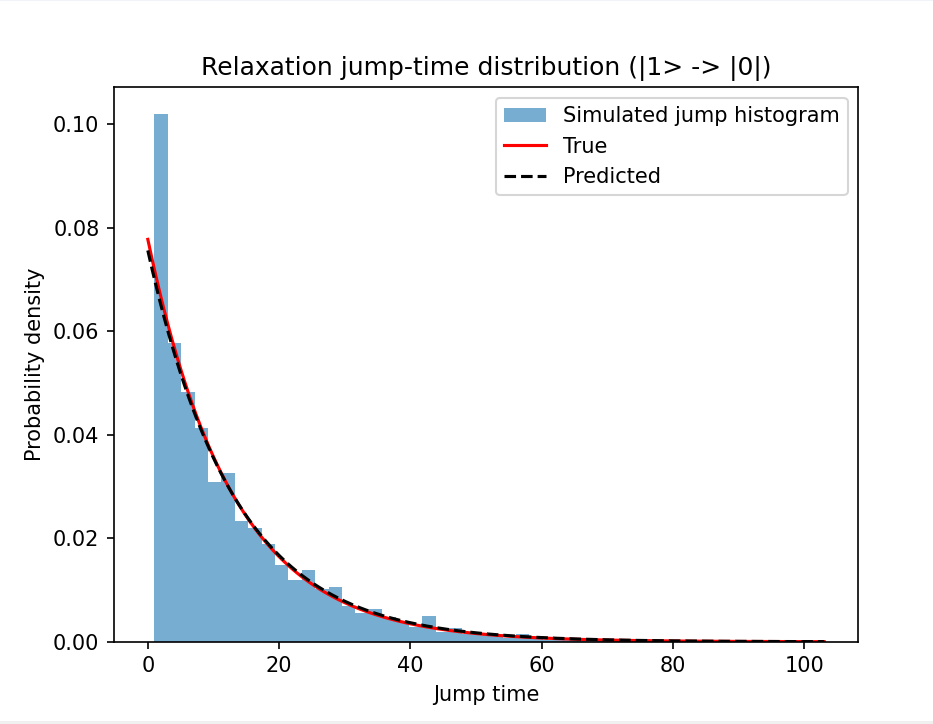
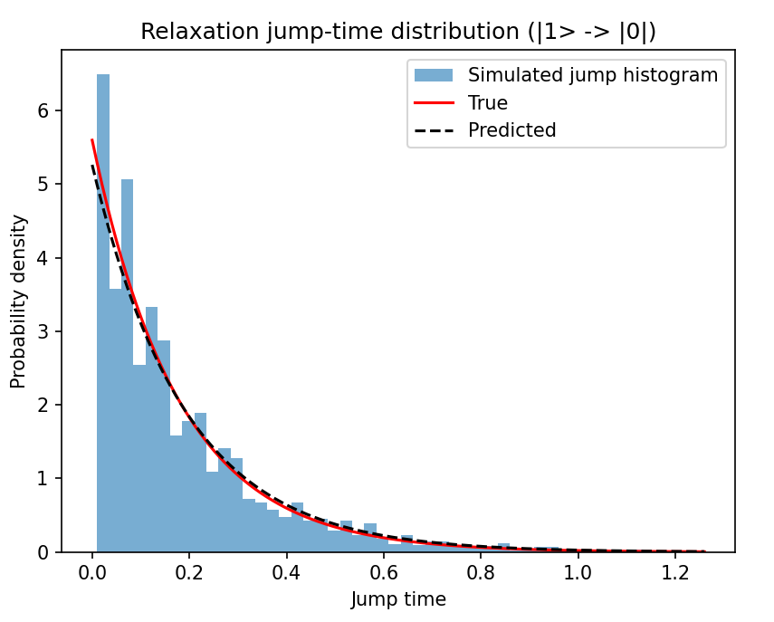
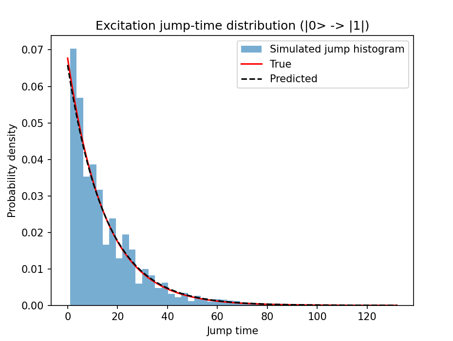
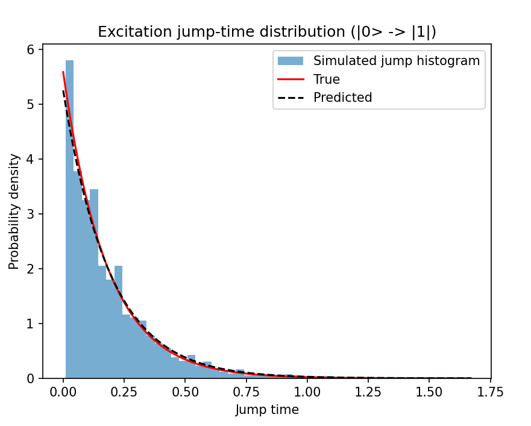

# Experiments

## T1 General Amplitude Damping Experiment

### T1 Energy Relaxation (|1⟩ → |0⟩)

- Energy relaxation, also known as **amplitude damping**, is a qubit property that describes the qubit’s tendency to **lose energy to the environment** (decay from the excited state |1⟩ to the ground state |0⟩).
- In our discrete-time simulation step `dt`, the relaxation probability is:
  - **γ_down = 1 - e^(-dt / T1)**
- Results:
  - **Relaxation Graph at 1 Kelvin**                     **Relaxation Graph at 77 Kelvin**

  -  

- As seen in the graphs, the relaxation behaviour matches the expected exponential decay.

### T1 Energy Excitation (|0⟩ → |1⟩)

- Energy excitation (also called **thermal excitation**) describes the qubit’s tendency to **gain energy from the environment** (transition from |0⟩ to |1⟩), mainly depending on temperature.
- In our discrete-time simulation step `dt`, the excitation probability is:
  - **γ_up = 1 - e^(-dt / T_up)**
- Results:
  - **Excitation Graph at 1 Kelvin**                    **Excitation Graph at 77 Kelvin**

  - 
- As seen in the graphs, excitation behaves realistically.
